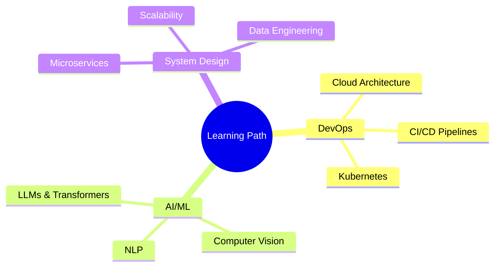

═══════════════════════════════════════════════════════════════════════════════════════════════════
██╗  ██╗███████╗██╗     ██╗      ██████╗     ██╗    ██╗ ██████╗ ██████╗ ██╗     ██████╗ ██╗
██║  ██║██╔════╝██║     ██║     ██╔═══██╗    ██║    ██║██╔═══██╗██╔══██╗██║     ██╔══██╗██║
███████║█████╗  ██║     ██║     ██║   ██║    ██║ █╗ ██║██║   ██║██████╔╝██║     ██║  ██║██║
██╔══██║██╔══╝  ██║     ██║     ██║   ██║    ██║███╗██║██║   ██║██╔══██╗██║     ██║  ██║╚═╝
██║  ██║███████╗███████╗███████╗╚██████╔╝    ╚███╔███╔╝╚██████╔╝██║  ██║███████╗██████╔╝██╗
╚═╝  ╚═╝╚══════╝╚══════╝╚══════╝ ╚═════╝      ╚══╝╚══╝  ╚═════╝ ╚═╝  ╚═╝╚══════╝╚═════╝ ╚═╝
═══════════════════════════════════════════════════════════════════════════════════════════════════

<div align="center">
  
  <!-- Header Banner -->
  

  <!-- Animated Intro -->
  

  <br/>
  
  <!-- Typing Animation -->
  

  <br/><br/>

  <!-- Profile Badges -->
  <a href="https://github.com/jayanthansenthilkumar">
    
  </a>
  <a href="https://github.com/jayanthansenthilkumar?tab=followers">
    
  </a>
  <a href="https://github.com/jayanthansenthilkumar?tab=repositories">
    
  </a>

</div>

<br/>

<!-- ═══════════════════════════════════════════════════════════════════════════════════════════════════ -->
<!-- ABOUT SECTION -->
<!-- ═══════════════════════════════════════════════════════════════════════════════════════════════════ -->


##  **About Me**


```yaml
name: Jayanthan Senthilkumar
located_in: India
current_role: Full Stack Developer & AI Engineer
education:
  degree: B.Tech in Artificial Intelligence & Machine Learning
  
expertise:
  - Full Stack Web Development
  - Artificial Intelligence & Machine Learning
  - Deep Learning & Neural Networks
  - Cloud Architecture & DevOps
  
currently_learning:
  - Large Language Models (LLMs)
  - System Design & Scalability
  - Data Engineering Pipelines
  
hobbies:
  - Building Innovative Solutions
  - Contributing to Open Source
  - Exploring New Technologies
```

<br clear="both"/>

<!-- ═══════════════════════════════════════════════════════════════════════════════════════════════════ -->
<!-- EXPERTISE SECTION -->
<!-- ═══════════════════════════════════════════════════════════════════════════════════════════════════ -->


##  **Areas of Expertise**

<div align="center">

<table>
<tr>
<td width="50%" align="center">

### 🌐 Full Stack Development


</td>
<td width="50%" align="center">

### 🤖 AI & Machine Learning


</td>
</tr>
</table>

</div>

<!-- ═══════════════════════════════════════════════════════════════════════════════════════════════════ -->
<!-- TECH STACK SECTION -->
<!-- ═══════════════════════════════════════════════════════════════════════════════════════════════════ -->


##  **Tech Arsenal**

<div align="center">

### 💻 Languages & Core Technologies
<p>
  
</p>

### 🚀 Frameworks & Libraries
<p>
  
</p>

### 🗄️ Databases & Cloud
<p>
  
</p>

### 🛠️ Tools & Platforms
<p>
  
</p>

</div>

<!-- ═══════════════════════════════════════════════════════════════════════════════════════════════════ -->
<!-- GITHUB STATS SECTION -->
<!-- ═══════════════════════════════════════════════════════════════════════════════════════════════════ -->


##  **GitHub Analytics**

<div align="center">

  <!-- Stats Cards Row -->
  <a href="https://github.com/jayanthansenthilkumar">
    
    
  </a>

  <br/><br/>

  <!-- Streak Stats -->
  <a href="https://github.com/jayanthansenthilkumar">
    
  </a>

  <br/><br/>

  <!-- Activity Graph -->
  

</div>

<!-- ═══════════════════════════════════════════════════════════════════════════════════════════════════ -->
<!-- TROPHIES SECTION -->
<!-- ═══════════════════════════════════════════════════════════════════════════════════════════════════ -->


## 🏆 **GitHub Trophies**

<div align="center">
  
</div>

<!-- ═══════════════════════════════════════════════════════════════════════════════════════════════════ -->
<!-- LEARNING & CONNECT SECTION -->
<!-- ═══════════════════════════════════════════════════════════════════════════════════════════════════ -->


<div align="center">

<table>
<tr>
<td width="50%" valign="top">

## 📚 **Currently Exploring**

<div align="center">



</div>

</td>
<td width="50%" valign="top">

## 🤝 **Let's Connect**

<div align="center">
<br/>

<a href="https://www.linkedin.com/in/jayanthan18" target="_blank">
  
</a>

<a href="mailto:jayanthansenthilkumar18@gmail.com">
  
</a>

<a href="https://ceo.prisoltech.com" target="_blank">
  
</a>

<a href="https://instagram.com/jayanthansenthilkumar" target="_blank">
  
</a>

<a href="https://github.com/jayanthansenthilkumar" target="_blank">
  
</a>

<br/><br/>

### 💬 Open for Collaborations!


</div>

</td>
</tr>
</table>

</div>

<!-- ═══════════════════════════════════════════════════════════════════════════════════════════════════ -->
<!-- CONTRIBUTION SNAKE -->
<!-- ═══════════════════════════════════════════════════════════════════════════════════════════════════ -->


<div align="center">
  
## 🐍 **Watch My Contributions Get Eaten**
  
<picture>
  <source media="(prefers-color-scheme: dark)" srcset="https://raw.githubusercontent.com/platane/snk/output/github-contribution-grid-snake-dark.svg">
  <source media="(prefers-color-scheme: light)" srcset="https://raw.githubusercontent.com/platane/snk/output/github-contribution-grid-snake.svg">
  
</picture>

</div>

<!-- ═══════════════════════════════════════════════════════════════════════════════════════════════════ -->
<!-- QUOTE SECTION -->
<!-- ═══════════════════════════════════════════════════════════════════════════════════════════════════ -->


<div align="center">
  
### 💭 **Random Dev Quote**


</div>

<!-- ═══════════════════════════════════════════════════════════════════════════════════════════════════ -->
<!-- FOOTER SECTION -->
<!-- ═══════════════════════════════════════════════════════════════════════════════════════════════════ -->


<div align="center">
  
  
  
  
  
  <br/><br/>
  
  
  
  <br/><br/>
  
  <!-- Footer Wave -->
  
  
</div>

<!-- ═══════════════════════════════════════════════════════════════════════════════════════════════════ -->
<!-- Made with 💜 by Jayanthan Senthilkumar -->
<!-- ═══════════════════════════════════════════════════════════════════════════════════════════════════ -->
